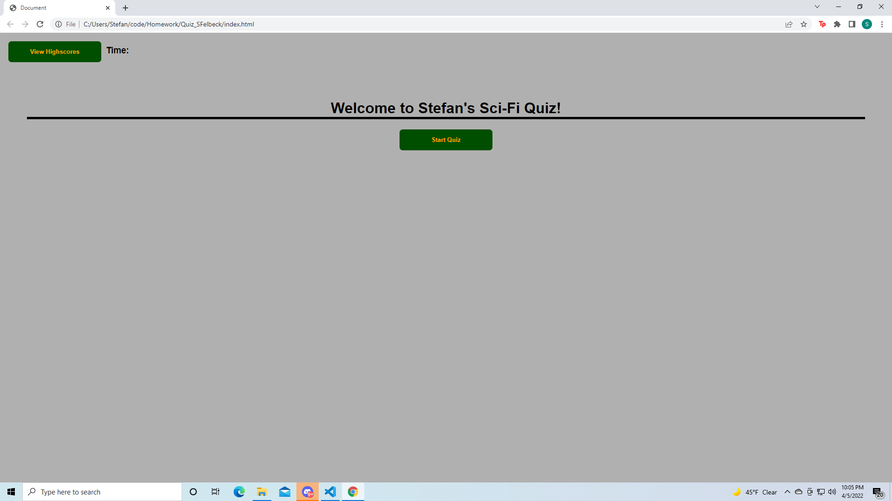
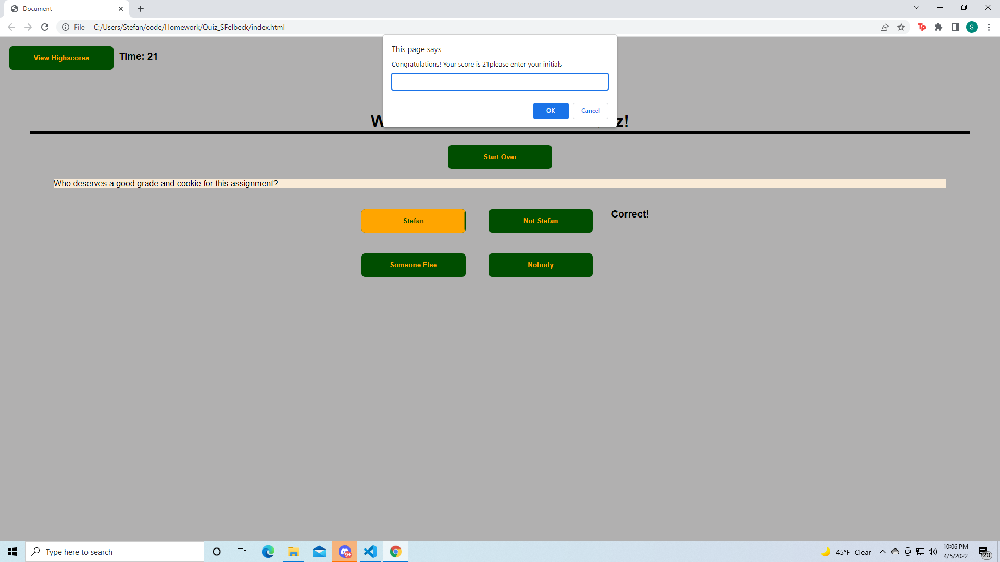
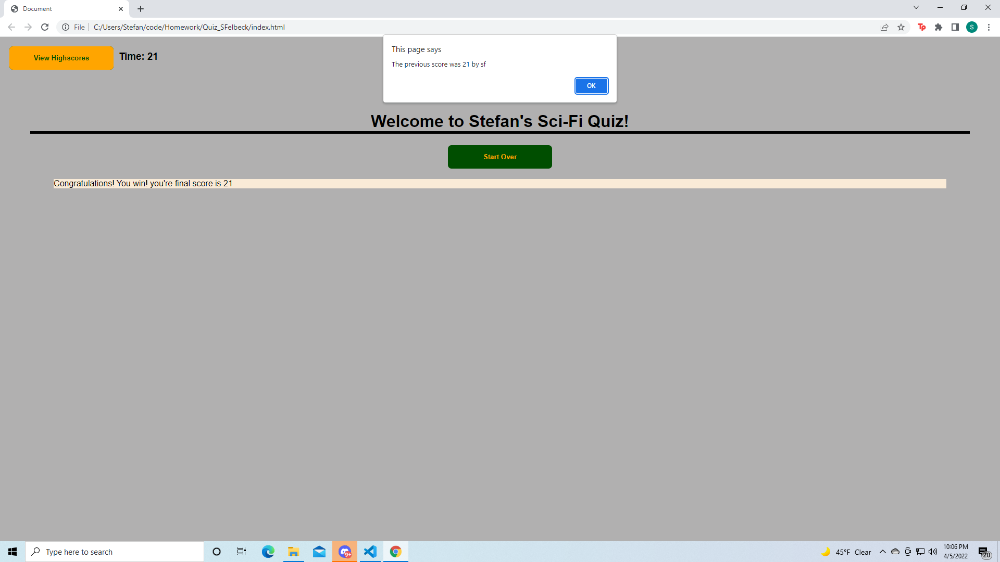

# Quiz_SFelbeck

This particular assignment proved to be incredibly difficult for me. I started by googling other multiple choice quizzes to see how similar projects were handled at various stages and I used techniques that seemed like the most efficient solutions. In particular I decided to store my questions and answers as objects in an array with a boolean to determine if answers were correct. Ultimately this approach turned out to be extremely difficult to make work with the rest of the code.
After consulting the instructional staff as well as my classmates I decided to remove the boolean and give the answers all unique identifiers, as well as using a long form if statement to check for exclusively the correct answer.
At the end I was finally able to make the application work to specification, however I have suspicions that there may have been a far more elegant way to handle the javascript portion of the assignment had I started with a different approach but I do not know what that would have looked like.

Here are some screenshots of the finished application in action!

